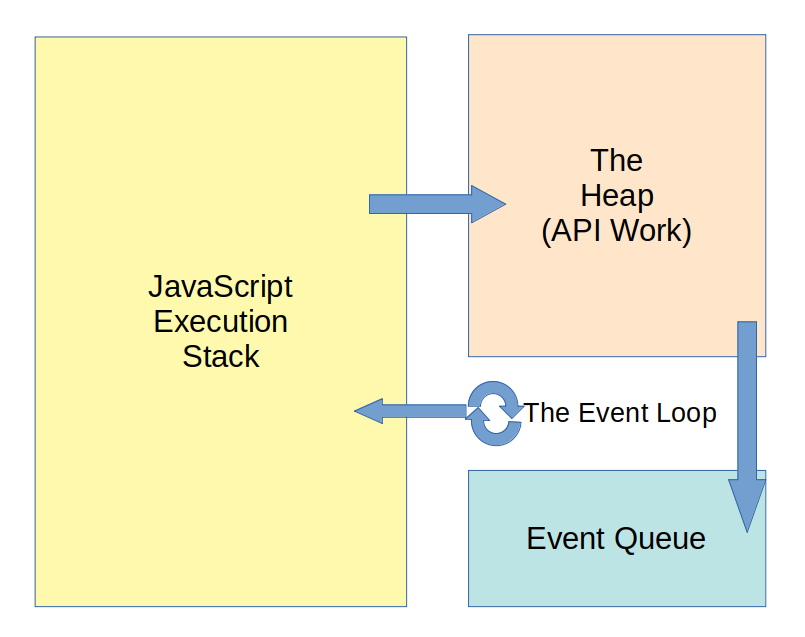

### Learning Objectives
- [x] Recap: Definition of Callback
- [x] Synchronous and Asynchronous programming
- [x] Async control flow with `setTimeout` and `setInterval`
- [x] Node.js File System
- [x] JavaScript Events

### Higher order function / Callback
1. A function that is passed to another function is a Callback
2. Callback is a placeholder that represent a future **Operation** when executed

```js
const search = (resource, target, cb) => {
  /** 
   * resource and target are placeholder representing a future value
   * cb is a placeholder representing a future operation
  */
  for (const element of resource) {
    if (element ===  target) {
      cb(element)
    }
  }
}

search(['Apple', 'Pineapple', 'Orange'], 'Apple', function(fruit) {
  console.log(`Found ${fruit}`)
})
```

### Synchronous Programming
1. JavaScript can only do one thing at a time
2. Synchronous JavaScript code will execute and finish in the same sequence as you write
3. An operation that takes long time to finish can potentially block the other code
  ```js
  console.log('Before loop');
  for (let i = 0; i < 10000000000000000; i++) {}
  console.log('Wait forever for this to run')
  ```
4. Even worse if an operation may or may not happens, which can block forever
5. The solution is to use **Asynchronous programming**

### Asynchronous Programming
1. JavaScript can queue up asynchronous code to allow non-blocking code to finish
2. Async codes are usually written in the form of Callback or Promise
4. There are 4 key components for asynchronous to work: Call Stack, Web API, Task Queue, Event Loop


### setTimeout and setInterval
1. `setTimeout` is an asynchronous functions that execute a callback after timer expires
  ```js
  let x = 1;
  console.log(`x before setTimout: ${x}`)
  setTimeout(() => {
    console.log(`x inside setTimout: ${x}`)
  }, 2000);
  console.log(`x after setTimout: ${x}`)
  ```
2. `setInterval` an asynchronous functions that repeatedly executes a callback with a fix interval
  ```js
  setInterval(() => {
    console.log('Nice to see you again');
  }, 3000)
  ```
3. Timer is the minimum guaranteed time
  ```js
  setTimeout(() => { console.log('see you in 3 second') }, 3000)
  for (let i = 0; i < 6000000000; i++) {}
  ```
4. `setTimeout` and `setInterval` can be nested
  ```js
  setTimeout(() => {
    console.log('after 1 second');
    setTimeout(() => {
      console.log('after 2 second')
    }, 1000)
  }, 1000)
  ```
5. timeout and interval can be clear
  ```js
  // 5 second count down
  let x = 5;
  const interval = setInterval(() => {
    console.log(x)
    x--;
    (x < 0) && clearInterval(interval)
  }, 1000)
  ```
6. timeout/interval 0 not affect the async nature
  ```js
  console.log('First');
  setTimeout(() => {
    console.log('Second')
  }, 0);
  console.log('Third');

  // First
  // Third
  // Second
  ```

### File System and fs module
1. Built in `fs` module to interact with file
2. Can either be synchronous or asynchronous
3. Data communicate in a form of Buffer by default
4. Refer to offical <a href="https://nodejs.org/dist/latest-v16.x/docs/api/fs.html">Doc</a>

```js
const fs = require('fs');

fs.readFile('./file.txt', 'utf-8' ,(err, data) => {
  console.log('Reading the file...');
  console.log(data)
})

fs.writeFile('./file.txt', 'Write something to file', (err) => {
  console.log('Finish Writing')
})
```
**Question**: What's wrong with above code ?

### JavaScript Events
1. Event is an action that registered ahead of time, and can be called later
2. Event can called synchronously or asynchronously
3. Async Event is very powerful in DOM

```js
const button = document.querySelector('button');
// event can be asynchronous
button.addEventListener('click', function() {
  console.log('button click')
})
console.log('After button click')

// event can also be trigger synchrouous
button.dispatchEvent(new Event('click'))
console.log('after trigger button click')

```
