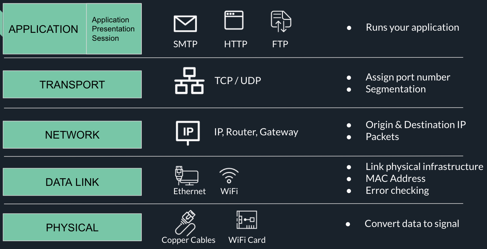

### Learning Objectives
- [x] Network and Internet
- [x] Layer of Internet (TCP/IP Model)
- [x] HTTP, Request and Response

### What is Internet
The Internet is a vast network that connects computers all over the world. Through the Internet, people can share information and communicate from anywhere with an Internet connection.

### TCP/IP Model

This is a good <a href="https://www.youtube.com/watch?v=keeqnciDVOo">video</a> to review internet model

### HTTP
#### What is HTTP
1. Hypertext Transfer Protocal
2. Utilizes TCP for client-server communication
3. HTTP is **stateless**
4. HTTP operates based on **request/response cycle**

#### URL
1. Uniform Resource Locator
2. The address of a given unique resource on the Web


#### Request method
1. GET - to read resources
2. POST - to write resources
3. PUT/PATCH - to update resources
4. DELETE - to delete resources

#### Request Header
A request header is an HTTP header that can be used in an HTTP request to provide information about the request context, so that the server can tailor the response. For example, the Accept-* headers indicate the allowed and preferred formats of the response. Other headers can be used to supply authentication credentials (e.g. Authorization), to control caching, or to get information about the user agent or referrer, etc.

```http
GET /home.html HTTP/1.1
Host: developer.mozilla.org
User-Agent: Mozilla/5.0 (Macintosh; Intel Mac OS X 10.9; rv:50.0) Gecko/20100101 Firefox/50.0
Accept: text/html,application/xhtml+xml,application/xml;q=0.9,*/*;q=0.8
Accept-Language: en-US,en;q=0.5
Accept-Encoding: gzip, deflate, br
Referer: https://developer.mozilla.org/testpage.html
Connection: keep-alive
Upgrade-Insecure-Requests: 1
If-Modified-Since: Mon, 18 Jul 2016 02:36:04 GMT
If-None-Match: "c561c68d0ba92bbeb8b0fff2a9199f722e3a621a"
Cache-Control: max-age=0
```
#### Request Body
1. Body is optional. Usually used with *POST/PUT/PATCH*
2. Contains information that you want to write on the server
3. Payload can be:
    - Form Data: default data type when using HTML form
    - JSON: usually sent through AJAX
    - Multipart/form-data: for carrying BLOB

#### Response Status
1. 200 Range: **Success**
    1. 200 OK
    2. 201 CREATED
    3. 202 ACCEPTED
2. 300 Range: **redirect**
    1. 301 MOVED PERMANENTLY
    2. 302 FOUND
3. 400 Range: **client error**
    1. 400 BAD REQUEST
    2. 401 UNAUTHORIZED
    3. 404 NOT FOUND
4. 500 Range: **server error**
    1. 500 INTERNAL SERVER ERROR

