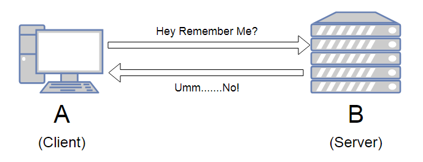

### HTTP Statless
1. HTTP don't remember states after a request/response cycle end
2. But sometimes it is necessary to "Remember" something from previous request



### HTTP Cookies
1. A piece of key/value pair stored in browser
2. Carried between HTTP requests
3. To identify a user, to track website visits, to optimized user experience, etc
4. READ cookie from request, and SET cookie in response
5. `cookie-parser` is a npm package that manage cookies in express

  ```js
  app.get('/cookie', (req, res) => {
    // read cookie
    const userId = req.cookies.userId;

    // set cookie
    res.cookie('userId', 1);
  })
  ```

### Session / Cookie based session
1. A temporary and interactive information interchange between two communicating devices
2. Information store on the server side.
3. Server provide a key `session_id` to access the session data, using cookie
4. Session provide extra layer of security as information is stored on the server

### Stretch Topic
1. Globally pass variable to EJS template
2. Video at https://vimeo.com/manage/videos/702193938/e7c454ca91
