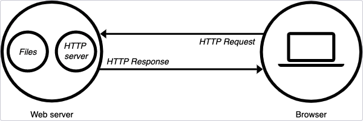

### Intro to Web Server
1. Web Server control how web users access hosted file
2. software that understands URL and HTTP
3. Act as a gateman between client and resources
4. Simple Node js HTTP server

  

  ```js
  const http = require('http');
  const hostname = '127.0.0.1';
  const port = 3000;

  const server = http.createServer((req, res) => {
    res.statusCode = 200;
    res.setHeader('Content-Type', 'text/plain');
    res.end('Hello World');
  });

  server.listen(port, hostname, () => {
    console.log(`Server running at http://${hostname}:${port}/`);
  });
  ```

### Express.js
1. A *lightweight*, node.js web framework
2. The main use of *Express* is to simplify the creation of route handlers
3. Easy configuration:
    - Create an express instance
    - define route and handler
    - Listen to a port
  
  ```js
  const express = require('express');
  const app = express();

  app.get('/', (req, res) => {
      res.send('Home page')
  });

  app.listen(3000, () => {
      console.log('Server start at port 3000')
  })
  ```

4. Five components of Express: Method, Route, Handler, Request, Response

### Middleware
1. *Middleware* is an interceptor function that runs between request and response
2. middleware make express powerful
3. Global and route specific middleware are avaiable
4. middleware package and custom middleware

  ```js
  app.use(express.urlencoded({ extended: true }));
  ```

### Template Engine
1. A processor to combine view template and data model
2. Dynamically generate HTML
3. Allows partials for reusable HTML
4. EJS (Embedded JavaScript)
  ```html
    <!-- Include some file from ejs template file -->
    <%- include('partials/header') %>

    <!-- Logical JavaScript, no output -->
    <% if(a > b) { %>
      <div>a is greater than b</div>
    <% >} %>

    <!-- output the value of a variable/expression -->
    <div>My name is <%= name %></div>
  ```

### Summary
1. **Web Server** is a software sitting between client and files/data on public address
2. **Express** is a framework to build web server
3. Follow Express syntax pattern and define *Method, Route, Request, Response, Handler*
4. **Middleware** is interceptor function run in sequence between request and response
5. **Template Engine** define view pattern, and generate HTML dynamically based on real time data