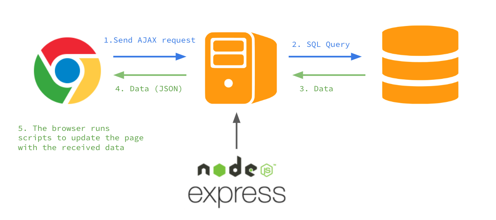
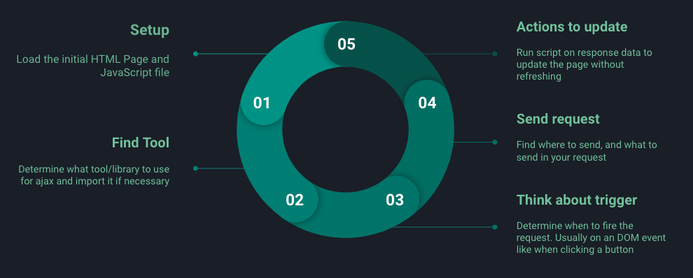

### Learning Objective
- [x] AJAX Concept
- [x] AJAX Example
- [x] Build Ajax with jQuery 
- [x] Discussion

### What is AJAX
* Asynchronous JavaScript and XML
* Allow broswer to exchange data and update the page without refreshing



### Sending AJAX request
1. Legacy way of sending AJAX using `XMLHttpRequest`

```js
var xhttp = new XMLHttpRequest();
xhttp.onreadystatechange = function() {
  if (this.readyState == 4 && this.status == 200) {
    console.log(xhhtp.responseText);
  } else if (this.readyState == 4 && this.status >= 400) {
    console.log('http error')
  }
}
xhttp.onerror = function() {
  console.log('There is a network error')
}
xtttp.open("GET", "https://jsonplaceholder.typicode.com/todos/1", true)
xhttp.send()
```

2. Modern AJAX with Promise based library

```js
jquery.get('https://jsonplaceholder.typicode.com/todos/1')
  .then(response => console.log(response))
  .catch(err => console.log(err))

fetch('https://jsonplaceholder.typicode.com/todos/1')
  .then(response => response.json())
  .then(data => console.log(data))
  .catch(err => console.log(err))
```

### Ajax Workflow
1. Provide the inital HTML page
2. Determine and import the tool for AJAX
3. Determine when to fire an ajax request --> DOM event
4. Determine where and what to send in request
5. Determine the action upon receiving the response



### Binding Event to dynamcially created Element
1. This is a bonus
2. You cannot register a event in advanced on something that created afterward
3. You need to bind event to a parent that already exist

```js
$('<button id="dynamic">New Button</button>').appendTo('body');

// This will not work
$('button#dynamic').on('click', function() { 
  
})

// This will work
$(document).on('click', 'button#dynamic', function() {

})
```

### Discussion
1. When to use AJAX
2. When to avoid AJAX
3. When to use AJAX with caution

|To Use AJAX           |To Avoid AJAX                     |Things to consider         |
|----------------------|----------------------------------|---------------------------|
|Client-side App/API   |Browser History                   |CORS                       |
|Perceived Performance |SEO requirement                   |Reconstructed entire page  |
|Better User Experience|Target client use outdated browser|Response Type: JSON vs HTML|