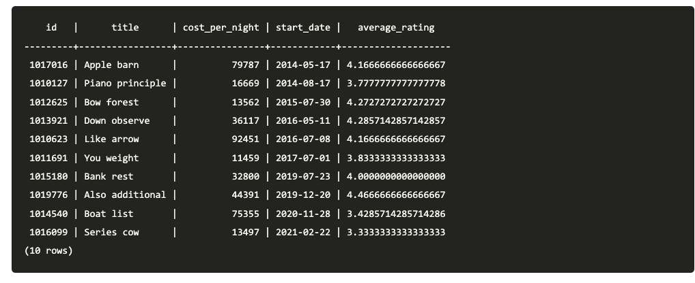
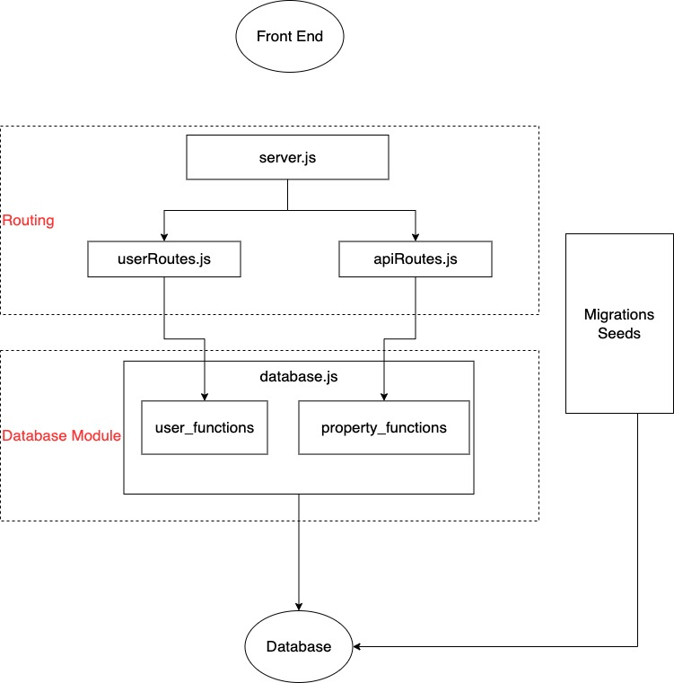

## Lighthouse BnB Q&A

- [x] SQL Query Structure
- [x] Work with Complicated Query
- [x] Structure your project

### SQL Query Structure
- **Clauses** are functions/sections in SQL to perform a specific task. They are in a specific order
- Exercise: Get all resevation for a guest number 1 and the its property reviews

```sql
-- SELECT Clauses
SELECT reservations.id, properties.title, properties.cost_per_night, avg(rating) as average_rating FROM reservations

-- JOIN Clauses
JOIN properties ON reservations.property_id = properties.id
JOIN property_reviews ON properties.id = property_reviews.property_id

-- WHERE Clauses
WHERE reservations.guest_id = 1

-- GROUP BY HAVING Clauses
GROUP BY properties.id, reservations.id HAVING cost_per_night > 20000

-- ORDER BY Clauses
ORDER BY reservations.start_date

-- LIMIT Clauses
LIMIT 10;
```

- Some Clauses are optionals, but they need to be in the correct order if exists

### Work with Complicated Query
- Where to start a query if there are multiple tables, multiple conditions and groups and aggregation
- Exercise: Get all resevations for a guest number 1 and the its property reviews

    

  1.  How many table involved?
      - reservation information => `reservations`
      - property information => `properties`
      - average rating information => `property_reviews`
  2.  Start with one table, query all static columns

    ```sql
    SELECT reservations.id, reservations.start_date FROM reservations
    WHERE reservations.guest_id = 1
    ORDER BY reservations.start_date;
    ```
  
  3. Start Join additional tables and add their static columns

    ```sql
    SELECT reservations.id, reservations.start_date, 
    -- Add new columns from other tables
    properties.title, properties.cost_per_night
    FROM reservations
    -- Add join on new tables
    JOIN properties ON reservations.property_id = properties.id
    WHERE reservations.guest_id = 1
    ORDER BY reservations.start_date;
    ```

  4. Target the aggregation/calculation. This usually require `JOIN` and `GROUP BY`

    ```sql
    SELECT reservations.id, properties.title, properties.cost_per_night, reservations.start_date,
    -- average rating is calculated from calling
    AVG(property_reviews.rating) AS average_rating
    FROM reservations
    JOIN properties ON reservations.property_id = properties.id
    -- join property_reviews table to get access to rating
    JOIN property_reviews ON properties.id = property_reviews.property_id
    WHERE reservations.guest_id = 1
    -- add group by to define how AVG is calculated
    -- usually you need to group by all non-aggregate tables' primary key
    GROUP BY properties.id, reservations.id
    ORDER BY reservations.start_date;
    ```

### Project Structure
- Seperate your code based on their functionality and responsibility
- **Routing**: Manage request and response, authentication, validation and business logic
- **Data module**: Interaction with database. Isolation from business logic
- **Migration/Seeding**: Project database setup

    

- What are the benefits of separation of concern?