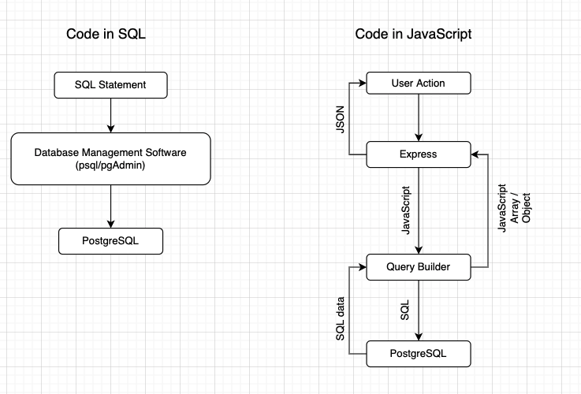

### Learning Objectives
1. Understand how application interact with database
2. Using `node-postgres` to build a Todo List
3. SQL and Web Security

### Interaction with Postgres through Application
1. We code in `JavaScript` instead of `SQL`
2. Postgres only understand SQL.
3. Use Query Builder translate JavaScript code into SQL



### node-postgres
1. The package name is called **node-postgres**, the npm package name is `pg`
2. An npm package to interfacing with PostgreSQL database
3. Support callback and promise, we will use promise
4. It allows us to communicate with PostgreSQL in JavaScript, for example:

```js
pgClient.query('SELECT * FROM students WHERE id = $1', [id])
  .then(result => {
    res.render('students', result.rows)
  })
```

### Review SQL Statement and CRUD
```sql
-- List all students
SELECT * FROM students;

-- Get student with id 1
SELECT * FROM students WHERE id = 1;

-- Create a student profile
INSERT INTO students (name, email, year, gpa) VALUES ('Jason', 'jason@gmail.com', 1, 3.5);

-- Update student 1's gpa to 3.0
UPDATE students SET gpa = 3.0 WHERE id = 1;

-- DELETE student who id is 10
DELETE FROM students WHERE id = 10;
```

### Setting up pg
1. use `Pool` or `Client` for connection. `Pool` is for multi connection, `Client` for single connection
2. config connection using object or connection string
3. Using `query()` to run statement and use promise to access result

```js
const { Pool } = require('pg');
const config = {
  user: 'lighthouse',
  password: 'lighthouse',
  database: 'college',
  host: 'localhost',
}

const pool = new Pool(config)


pool.query(query)
  .then(({ rows }) => {
    // query() resolve an Result object
    // data stored in rows as Array 
    console.log(rows)
  })
  .catch(err => {
    console.error(err)
  })
```
### Web Security - SQL injection
1. A web security vulnerability that allows attackers to interfere with the queries
2. Directly inject user input into database as trusted SQL
3. Solution is to run query sanitation, use prepared statement

```js
pool.query('SELECT * FROM students WHERE id = $1;', [id])
```

### Web Security - Credentials and Env variable
1. We NEVER want to push keys/secrets to Github
2. Inject the credentials at runtime
3. We use environment variables to accomplish this task