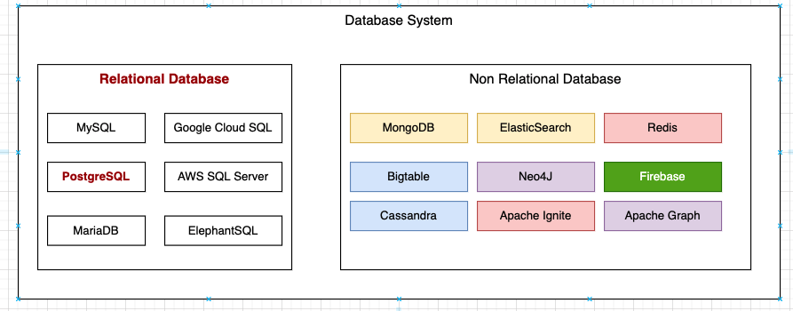
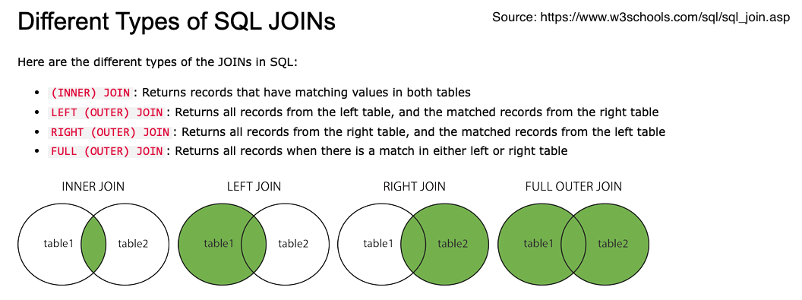

### Learning Objectives
1. Database Concept and Database Software
2. Relational Database
3. Structured Query Language or SQL

### What is Database
1. An organized collection of information stored electronically
2. A program that interact and manipulate data is called Database Management System(DBMS)
3. Data and Database Management System together are often referred to as Database


### SQL for Table
|Action|Syntax|
|------|------|
|CREATE|CREATE TABLE IF NOT EXISTS table_name ( column_name_1  datatype  column_constraint, column_name_2  datatype column_constraint)|
|MODIFY|ALTER TABLE table_name action column_name [datatype column_constraint]|
|DELETE|DROP TABLE IF EXISTS table_name|

### SQL Statement for DATA
| CRUD   | Syntax                                                                          |
|--------|---------------------------------------------------------------------------------|
| CREATE | INSERT INTO table_name (column_1, column_2, ...) VALUES (value_1, value_2, ...) |
| READ   | SELECT column_names FROM table_name WHERE conditions                            |
| UPDATE | UPDATE table_name SET column_name = value WHERE conditions                      |
| DELETE | DELETE FROM table_name WHERE conditions                                         |

exmaple
```sql
-- add Bob to student's table. Bob's email is bob@gmail.com and he is 3rd year
INSERT INTO students (name, email, year) VALUES ('Bob', 'bob@gmail.com', 3);

-- get all first year students' name and email
SELECT name, email FROM students WHERE year = 1;

-- update Bob's email to bob@shaw.ca
UPDATE students SET email = 'bob@shaw.ca' WHERE name = 'Bob';

-- remove all 4th year students
DELETE FROM students WHERE year = 4;
```

### Data from multiple table
```sql
SELECT * FROM table_A JOIN table_B ON table_A.id == table_B.a_id;
```


### Aggreate Function
* Functions to compute a single value from multiple rows
|     |                                    |
|-----|------------------------------------|
|AVG  |Calculate the average               |
|COUNT|To count the total number of results|
|SUM  |To summarize a column               |
|MIN  |Get the minimum value of a column   |
|MAX  |Get the mamimum value of a column   |

```sql
SELECT COUNT(*) FROM students;
SELECT MIN(gpa) FROM students WHERE year = 1;
```

### Grouping Result
- Grouping the rows that has same value in one or more columns into one summary column
- GROUP BY often used with Aggregate functions
- Use HAVING to filter the results

```sql
SELECT major_id, AVG(gpa) from students GROUP BY major_id HAVING AVG(gpa) > 3.0
```

### WHERE vs HAVING
- `WHERE` and `HAVING` are both filtering
- In some senario they produce the same outcome, for example

```sql
SELECT majors.name, AVG(gpa) FROM students JOIN majors ON students.major_id = majors.id
GROUP BY majors.name HAVING majors.name = 'Economy';

SELECT majors.name, AVG(gpa) FROM students JOIN majors ON students.major_id = majors.id
WHERE majors.name = 'Economy'
GROUP BY majors.name;
```

- `WHERE` run before `GROUP BY`, `HAVING` run after `GROUP BY`
- `WHERE` run against raw table. `HAVING` run against grouped query result
- `WHERE` column do not need to be in `SELECT`, `GROUP BY` need to be in `SELECT`