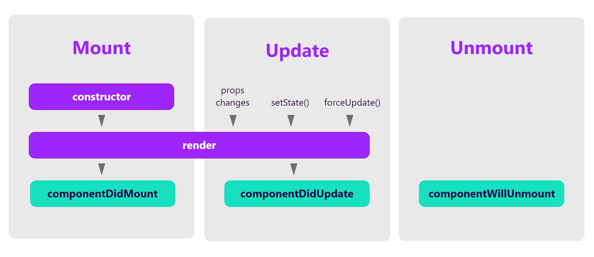
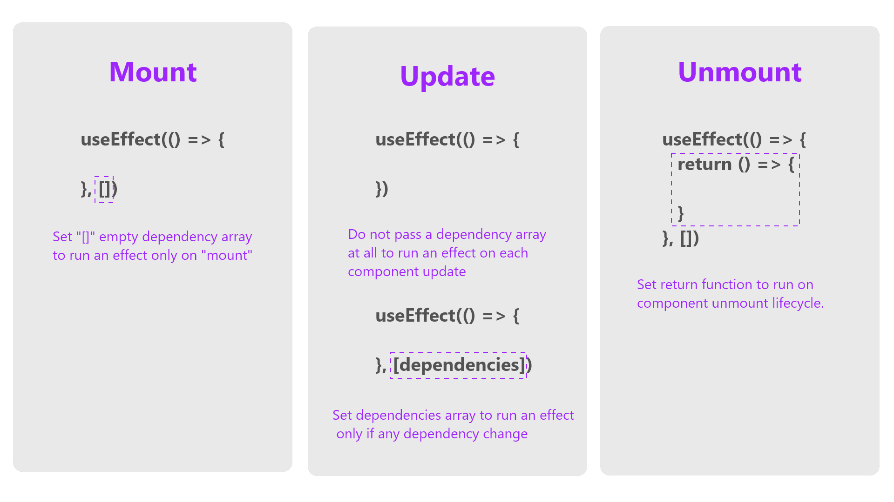

# W19: Class-based Components

- [x] Review of Classes and OOP
- [x] History of Class-based Components in React
- [x] Refactor `funny_camp` to Class based components
- [x] Component Lifecycle Method
- [x] Trends with Class-based Components

### JavaScript and Object Orient Programming
* JavaScript is multi-paradigm programming language that support functional and object-oriented programming
* Object-oriented programming (OOP) is a computer programming model that organizes software design around data, or objects, rather than functions and logic.
* We have been programming in a functional and procedural way using JavaScript
    
    ```js
    const a = 5;
    const b = 10;

    function sum(x, y) {
        return x + y;
    }

    const c = sum(a, b) // 15
    ```

* JavaScript can also be written in object-oriented approach

    ```js
    class Vehicle {
        constructor(make, model, mileage) {
            this.make = make;
            this.model = model;
            this.mileage = mileage;
        }

        move(distance) {
            this.mileage = this.mileage + distance
        }
    }

    class Car extends Vehicle {
        constructor(make, model, mileage) {
            super(make, model, mileage)
        }

        drive(distance) {
            super.move(distance)
        }

        honk() {
            console.log(`${this.make} is honking: Honk honk!`);
        }
    }

    class Airplane extends Vehicle {
        constructor(make, model, airline, mileage) {
            super(make, model, mileage)
            this.airline = airline
        }

        fly(distance) {
            super.move(distance)
        }
    }

    myCar = new Car("Tesla", "Model 3", 0)
    yourCar = new Car("Ford", "F-150", 10000)
    plane = new Airplane("Airbus", "A320", "Air Canada", 123)

    ```

* OOP in JavaScript behave different than other traditional OOP languages such as Ruby, Python, C++

## History of Class-based Components in React
1. React was first Introduced in 2013
2. React use JavaScript ES6 class to create component and Manage States Until...
3. Introduction of Hooks in React 16.8 (2019)
4. Functional Component is the future, but large amount of App are based on Class Components

## Class Based Component
1. Wirte a Class instead of a Function. React will "initalize" the component for you at run time
2. You cannot customize how you call your state. It has to be `state` and `setState`
3. Class component will **ALWAYS** have a `render` function that return JSX
4. Because it is a class, we have to use `this` to refer to any method or property we defined
5. Computed property has to go inside of `render` method
6. State Management Method need to **Bind** first before it can be passed as prop
7. Use [Component Lifecycle](#component-lifecycle-method) Method to for data fetching and side effect

```js
export default class CampgroundList extends React.Component {
    // Constructor
    constructor () {
        super();
        this.state = { campgrounds: [] }
        // method binding
        this.bookCampground = this.bookCampground.bind(this)
    }

    // Lifecycle Method to run at certain stage
    componentDidMount() {
        fetch('http://localhost:3030/campgrounds')
        .then(res => res.json())
        .then(campgroundData => {
            this.setState({ campgrounds: campgroundData })
        })
    }

    bookCampground(id) {
        const newCampgrounds = this.state.campgrounds.map(c => {
            if (c.id === id) {
                return {...c, available: false}
            }
            return c
        })
        this.setState({ campgrounds: newCampgrounds })
    }
    // must have a render method
    render() {
        const campgroundsList = this.state.campgrounds.map(cg => {
            return (
                <CampgroundListItem key={cg.id} campground={cg} bookCampground={this.bookCampground} />
            )
        })

        return (
            <div className="container campground-list">
                <div className="row">
                    {campgroundsList}
                </div>
            </div>
        )
    }
}
```

## Component Lifecycle Method
1. It’s very important to free up resources taken by the components when they are destroyed. 
2. We can declare special methods on the component class to run some code at specific stage.

    

3. With hook, we can achieve the same result by `useEffect`

    

<small>The above graph is from [hello-js.com](https://hello-js.com/articles/react-class-and-hooks-lifecycle-explained/). This article explains the react cycle and hook concept very well</small>
