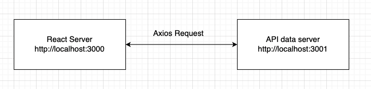

# Data Fetching & Side Effect
- [x] Component Side Effect
- [x] useEffect hook for side effect
- [x] Data Fetching with React
- [x] Computed value

### Component Side Effect
1. React component is a function. It receive an input and produce a predictable JSX
2. Sometimes we have some actions that is outside of React's control and not predictable
3. Side effect is unpredictable but important
4. Common Side effect in React include:
    1. `setTimeout` and `setInterval`
    2. Update DOM directly, bypassing React
    3. `console.log`
    4. Talk to external server (eg: `axios`, `fetch`)

### useEffect
1. A hook function that all us to run side effect once component **rendered**
2. `useEffect` take a callback and a list of dependencies

```jsx
// Do something_else when something change and component rendered
useEffect(() => {
  // do something when the component rendered
}, [])
```

3. The second arguments is called dependencies. It let you specify when to run the hook

```jsx
// After component render, do something if a or b has changed
useEffect(() => {
  // do something
}, [a, b])
```
3. Why `useEffect` seems to run twice at the beginning?
4. **BE VERY CAREFUL** when update the value in effect's dependency array.

```jsx
  const [time1, setTime1] = useState(0)
  // Why this is not a good idea?
  useEffect(() => {
    setTime1(time1 + 1)
  }, [time1])
```

### Effect CleanUp
1. We may want to stop an effect when component unmounted
2. Eg: a pending request. A timeout/time interval
3. To cleanup, 

```jsx
  useEffect(() => {
    const i = setInterval(() => {
      setTime3(time + 1)
    }, 1000);

    // clean the previous interval everytime component re-render
    return () => clearInterval(i)
  }, [time])
```

### Fetching Data with React
1. React don't have its own data source
2. Use `ajax` to fetch/post data
3. Library such as **axios** can be used
4. Axios is a promise-based http request library. https://www.npmjs.com/package/axios

```js
const fetchData = () => {
  axios.get('http://localhost:3001/languages')
    .then(response => {
      console.log(response)
      setData(response.data)
    })
}
```

5. React is front end only server. 



#### Tips and Tricks
1. ajax request usually goes with state update
2. request can be trigger by event, or effect
3. Understand that React run on its own server. And request data from a different server

### Computed Property
1. A variable that defined directly inside react component
2. A value is derived from a state or props
3. Will automatically re-calculated with its depending value change