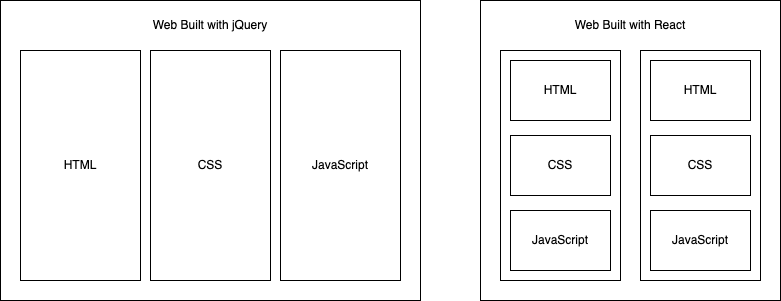

# JSX and Props

- [x] React Fundamentals
- [x] JSX Syntax
- [x] Data communication with Props

### What is React. Our First React Component
1. Component Based Declarative Library for UI
2. React Component is JS function that returns HTML-like view
3. React component is vertically structured

    

4. React Component hold nested structure

    ```jsx
    const App = () => {
        return (
            <div>
                <Title />
                <List />
                <Footer />
            </div>
        )
    }
    ```

### First Glance of JSX
1. JSX is template engine for React, similar to EJS to Express. It takes all HTML
2. Every React component return JSX
3. JavaScript express embedding

    ```jsx
    <h1 style={titleStyle}>{title}<h1>
    ```

4. Component Embedding

    ```jsx
    <App>
        <Title />
        <PhotoList />
    </App>
    ```
5. JSX require a single Root

### JSX - Continue
1. Fragment with `<></>`
2. Child Element Array Map

    ```js
    const campsites = [
            { id: 1, site: "Jasper Whistler", price: 39 },
            { id: 2, site: "Banff Lake Louise", price: 41 },
            { id: 3, site: "Riding Mountain Wasagaming", price: 35 }
        ]

    const campsitesList = campsites.map(campsite => {
        return (
            <div key={campsite.id} style={campsiteStyle}>
                <h4>{campsite.site}</h4>
                <small>${campsite.price}/night</small>
            </div>
        )
    })
    ```

## React Props
1. component talk to each other using **props**
2. Parents pass information to child using props, like JS function argument

    ```js
    const appTitle = "Funny Camp React Demo"

    return (
        <>
            <Title title={appTitle} />
            <Description title={appTitle} />

            <div style={campsiteListStyle}>
                {campsitesList}
            </div>
        </>
    )
    ```

## Create React App
1. A npx command to generate react app
2. `create-react-app` generate front-end only application with static server

    ```
    npx create-react-app my-app
    cd my-app
    npm start
    ```
