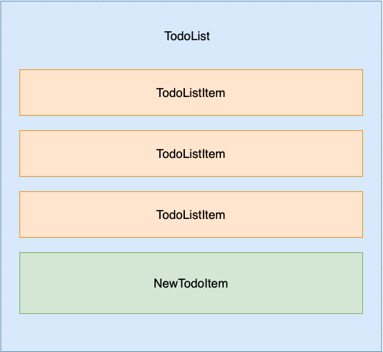

## Content
- [x] Design and Build Component
- [x] Data Fetching from and API
- [x] Immutable update pattern


## Build Component

- [x] A **TodoList** component wrap all the todo
- [x] A **TodolistItem** component to show each individual todo
- [x] A **TodoForm** component to draft a new todo
- [x] The `todos` state should be in the `TodoList` component
- [x] The action to **Fetch**, **Modify** and **Delete** should be defined in **TodoList** component
- [x] The action to **Add** should be defined in both **NewTodoItem** and **TodoList** component

## Data Fetching from API
1. React rely on external data source, through AJAX request
2. Cross-Origin Resource Sharing (CORS)
    1. Often API server do not allow unknown incoming request
    2. Config "Trusted" domain by setting response header

```js
  res.setHeader('Access-Control-Allow-Origin', 'http://localhost:3000');
  res.setHeader('Access-Control-Allow-Methods', 'GET, POST, PUT, DELETE');
  res.setHeader('Access-Control-Allow-Headers', 'X-Requested-With,content-type');
```

## Immutable Update Pattern
1. Data should be update at where it is defined (State)
2. Actions are always defined in the same component
3. Actions can be passed down as `props` to allow child component to trigger the update
3. Update backend first, then update the `state` when receiving response

```js
  const deleteTask = (id) => {
    axios.delete(`http://localhost:3001/api/todos/${id}`)
      .then(response => {
        setTodos(todos => {
          return todos.filter(todo => todo.id != id);
        })
      })
  }
```