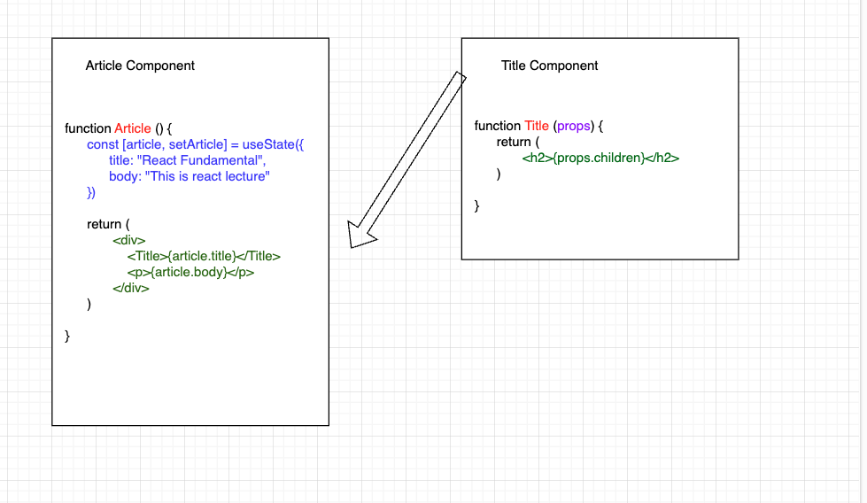
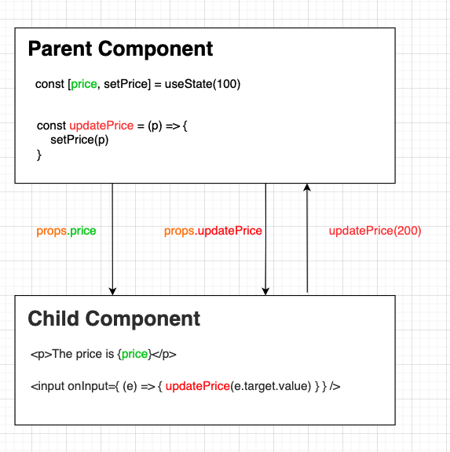

# State Management and Immutable Update Patterns
- [x] Review of Components and State Management
- [x] Immutable Update Pattern

### React Component and State Management
1. React Component is a function that return JSX as view
2. React Component holds "State" which is a piece of data the component own
3. When State change, component re-render. State value persist between render
4. React Component can accept value from parent components as "props"
5. Child component cannot modify "props"

    

### Immutable State Update
1. State is immutable. Use setter to **replace** the entire state
2. State can only be updated from the component it defined
3. To update state from children, pass setter as **props**

    

### State Management with Reducer
1. State can be complicated (Array of objects with multiple keys) that is hard to manage with **useState**
2. `useReducer` hook expert in managing more complex state scenario

    ```js
    // reducer -> centralize, custom defined logic to update state
    const reducer = (state, action) => {
        switch (action.type) {
            case "CASE 1":
                // do something
                return "new State 1"
            case "CASE 2":
                // do something else
                return "new State 2"
        }
    }

    const [state, dispatch] = useReducer(reducer, initalState)

    // dispatch is the trigger switch to call reducer
    ```
3. `useReducer` help manage states in a more efficient way. However, it cannot do anything `useState` cannot do

### BONUS: Redux Library
1. JS Library for managing and centralizing application state
2. Used to be the go-to approach to manage state globally across the entire app
3. Take a quick glance here https://www.youtube.com/watch?v=_shA5Xwe8_4