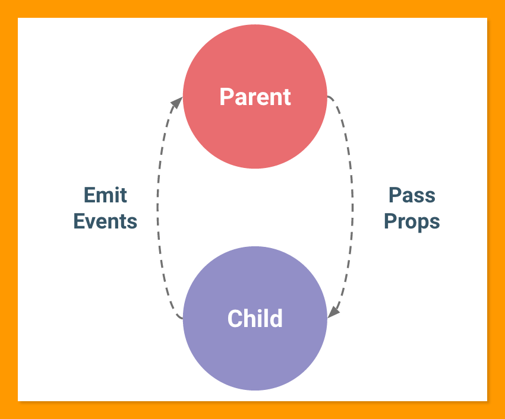

# What is React State

- [x] What is React State
- [x] States vs Props
- [x] State Management & Event Handling
- [x] Lift Up State

### React State
1. In JavaScript, we use **Variable** to store value for future use.
2. React **Re-render**, and previous defined variable is not available in a new cycle
3. React use **State** to maintain values between each render
4. When state change, component re-render

    ```js
    export default function Title () {
        const [title, setTitle] = useState("Funny Camp")

        const onClickTitile = () => {
            setTitle(() => {
                return "Oh! You clicked on me"
            })
            console.log(title)
        }
        return <h1 onClick={onClickTitile}>{title}</h1>
    }
    ```

### State and Props
1. **State** is component internal data. Component holds and manages the state.
2. **State**, though immutable, is replacable using `setState` hook
3. **Props** is data received from parent Component. 
4. Component cannot update **Props** values
5. It is all about data ownership

    ```js
    const bookAll = () => {
        // setCampsiteList((currentList) => {
        //     return currentList.map((currentCampsite) => {
        //         return {...currentCampsite, status: 'Booked'}
        //     })
        // })

        const campsiteListCopy = campsiteList.map(campsite => {
            return {...campsite, status: 'Book'}
        })
        setCampsiteList(campsiteListCopy)
        
    }
    ```

### State Management and Event Handling
1. React is Data-Driven. Data should only be changed by its owner
2. State should be updated in the component it is defined
3. Child component can "Trigger" update, by calling props function passed from parent
4. This is called Event Emitting

    

5. Tips on Update state
|Where   |How  |
|---|---|
|From its own component|Call `setState` function directly|
|From child component| Pass update function as props, execute the props function in child  |
|From sibling component   |Lift Up State   |

### Lift Up State
1. In React, there is only two way to update states:
    1. Update in its component
    2. Pass props, and emit event in child(descendant) component
2. In React, there is only one way to read data from other components:
    1. Child read data from parent's props

3. Think about React structure as a family tree. Data can only passed and update through "Lineage" relationship.

4. Anyting else, **Lift State Up**, moving up to common parents