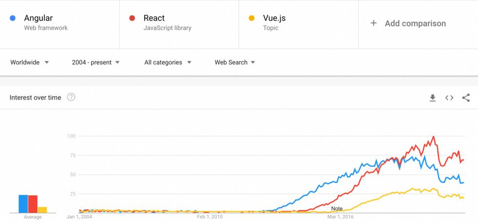

# Advanced Topic
- [x] Front End Framework with VUE
- [x] Docker 101

### React vs Angular vs Vue

|Parameters|React|Angular|Vue|
|---|---|---|---|
|Framework Size|Small|Large|Small|
|CLI tool|create-react-app|@angular/cli|@vue/cli|
|Language|JavaScript|Typescript|JavaScript|



### Build a Machine Learning App with Vue

- Install **Vue CLI** with `npm i -g @vue/cli`
- Create project with `vue create <project name>`

### Vue Basic Syntax
- Each Component contains `<template>`, `<script>` and `<style>`
- Each component export a JS object that can contains the following KEY:
  - **data**: A function that returns a set of component *states*
  - **methods**: A collection of function that can be used within component and its template
  - **props**: acceptable props from parent, array or object (If type is required)
  - **computed**: pre-calculated, cached value
- [Directives](https://vuejs.org/api/built-in-directives.html#built-in-directives)
  - some special token in the markup to tell library to do something to a DOM elements
  - `v-if`, `v-else`, `v-else-if` to conditionally render some HTML elements
  - `v-bind` to bind attribute to an expresion
  - `v-model` two way binding of form element to a state
  - `v-for` to render a list of elements
  - `v-on` to handle event, shortened to `@`

### Machine Learning with Image Classification


### Containerization and Docker
##### What is Containerization
> Containerization is a software deployment process that bundles an application’s code with all the files and libraries it needs to run on any infrastructure. Traditionally, to run any application on your computer, you had to install the version that matched your machine’s operating system.

##### What is Docker
> Docker is an open platform for developing, shipping, and running applications. Docker enables you to separate your applications from your infrastructure so you can deliver software quickly. With Docker, you can manage your infrastructure in the same ways you manage your applications. 

##### Image
> A snapshot of your App and its environment in a form of layering (Node -> App -> Nginx)
##### Container
> A realization of image and an actual runtime for your App

- Install Docker Desktop
- Add a `Dockerfile` to the project
    ```
    FROM node:18.18-bullseye as build

    WORKDIR /app

    RUN npm install -g @angular/cli

    COPY ./package.json ./

    RUN npm install

    COPY . .

    EXPOSE 4200

    CMD ["ng", "serve", "--host", "0.0.0.0"]
    ```
- Build docker image `docker build`
- Run container `docker run`