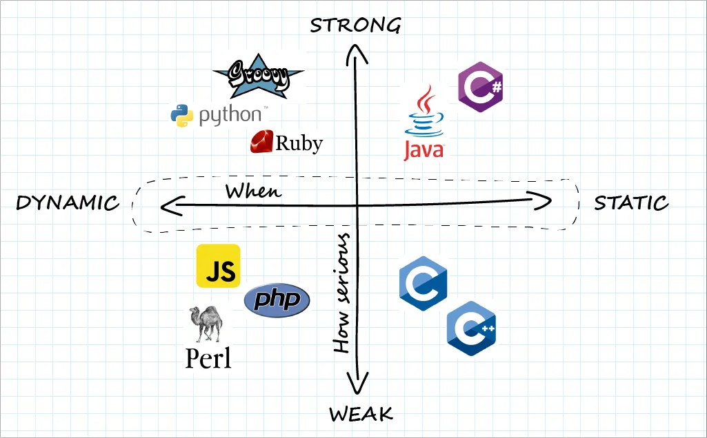

### Intro to Ruby
- [x] Programming Paradigm
- [x] Ruby Language
- [x] JavaScript vs Ruby

### Programming Paradigms
1. Ruby is a **Object Oriented, multi-threading, scripting** languages
2. Ruby is strongly, dynamically typed languages
3. Type Safety
  
  
    * The extent a language prevents type errors
    * Weakly type language favor developers' ease of use
    * Strongly type language favor correctness
    * Dynamically vs Statically
    ```js
      function sum(a, b) {
        return a + b;
      }
      // 10
      console.log(sum(5, 5));
      // ABCD
      console.log(sum('AB', 'CD'));
    ```

    ```c
      // staticly type checking
      int sum(int a, int b)
      {
          return (a + b);
      }
      // 10
      printf("%d", sum(5, 5));
      // error: expected ‘int’ but argument is of type ‘char *’
      printf("%s", sum("AB", "CD"));
    ```
    

### Ruby Programming Language
- [x] Variables and types
- [x] Conditionals
- [x] Loops
- [x] Methods / Function
- [x] Array and Hashes
- [x] Blocks
- [x] Class

#### Variable and Types
* Common types are Integer, Float, String and Symbol.

  ```rb
  int = 1 # Integer
  float = 1.0 # Float
  str = "hello" # String
  sym = :symbol # Symbol
  ```

* use `.class` to verify type
* String Concatenation
  ```rb
  hello = "Hello"
  greeting = "#{hello} World" #Literal
  greeting = hello + 'World'
  ```

* Everything in Ruby is object
  ```rb
  puts 10.to_s # "10" -> number 10 is object that has a .to_s method
  ```

#### Conditional
* Multiple Syntax: `if..else`, `case..when`, `unless`, Inline conditional
* **IF..ELSE** block need to be closed
  
  ```rb
  if num > 0
    puts 'Positive'
  elsif num < 0
    puts 'Negative'
  else
    puts 'Zero'
  end
  ```
* Inline condition

  ```rb
  puts "True" if true
  puts "False" unless false
  ```
* Generally, ruby will not automatically convert type when comparing
  ```rb
  1 == '1' # False
  1 === '1' # False
  1 == 1.000 # True
  1 == 1.0000000000000001 #True
  ```
* Unlike JavScript, only `nil` and `false` are **falsy**

#### Loops
* There are *tons* of different way to loop in ruby
* `For` loop

  ```rb
  for i in 0..5
    puts i
  end
  ```
* `While` loop

  ```rb
  i = 0
  while i < 5
    puts i
    i += 1
  end
  ```

* `Until` loop

  ```rb
  j = 0
  until j == 5
    puts j
    j += 1
  end
  ```

* `.each` loop

  ```rb
  ['Apple', 'Banana', 'Orange'].each do |fruit|  # do is required here to indicate a block
    puts fruit
  end
  ```
* Loop always accept a `block`. The keyword `do` is sometimes necessary
* use `break` and `next` to terminal or skip the iteration
* Prefer `.each` over other method

#### Methods / Function
* Method is defined between `def` and `end` keyword
* Last executed line is implicitly returned
* splat the parameter
* no need to use `()`, no need to `return`

  ```rb
  def sum_all(*nums)
    sum = 0
    nums.each do |num|
      sum += num
    end
    sum
  end
  sum_all 1, 2, 3, 4, 5
  ```

#### Array and Hashes
* Hash is a collection of key-value pair
* Symbol is most used as hash key
* Use bracket notation to access the value
  ```rb
  person = {
    :name => 'John',
    age: 25,
    'email': 'john@gmail.com'
  }

  person[:name]
  ```

* Ruby array is very simlar to JavaScript, but with more method

  ```rb
  arr = [1, 2, 3, 4]

  puts arr[1] # 2
  puts arr.size # 4
  ```

#### Blocks
* Block is similar to JavaScript 'callback'. 
* Block cannot run its own. It has to attach to a method
* Block is a code piece between `do..end` or **Inline**
* Block is **NOT** method parameters

  ```rb
  1.upto(3) do |num|
    puts num
  end

  ['Apple', 'Banada'].each { |fruit| puts fruit }
  ```

* In custom method, use `yield` to execute a block

  ```rb
  def math (a, b)
  puts "Input #{a} and #{b}"
  result = yield a,b  #yield indicate executing a block
  puts "result is #{result}"
  end

  math 10, 20 do |a, b|
    a + b
  end
  ```

#### Class and Object
* Class is the **blueprint** for objects
* Object is the **instance** of a class
* instance variable is private to an object
* class variable is private to class
* use **accessor** to access instance/class variable

  ```rb
  class Vehicle
    # Class variable
    @@count = 0
    # 
    def self.count_total
      puts "Total number of vehicles are: #{@@count}"
    end

    def initialize(year, make, model)
      @year = year
      @make = make
      @model = model

      @@count =+ 1
    end

    # attribute accessor
    attr_accessor :model

    # attribute reader and writer
    attr_reader :make
    attr_writer :make

    # getter
    def year
      @year
    end

    # setter
    def year=(value)
      @year = value
    end

    # Instance method
    def get_info
      puts "It is a #{@make} #{@model} from #{@year}"
    end

  end

  my_car = Vehicle.new 2010, 'Ford', 'Mustang'
  your_car = Vehicle.new 2020, 'Honda', 'Civic'

  my_car.info
  ```


### JavaScritp vs Ruby
* Dynamically typed - Change type is permitted
  ```js
  // JavaScript
  let variable = 'Hello';
  variable = 100;
  ```
  ```rb
  # Ruby
  variable = 'Hello'
  variable = 100
  ```
* JavaScript don't protect type errors. Ruby cares about types

    ```js
    // JavaScript
    console.log(100 + '100') // 100100
    ```
    ```rb
    # Ruby
    # TypeError (no implicit conversion of Integer into String)
    puts 100 + '100'
    ```

* JavaScript and Ruby both allows you to run a code block inside a method/function
  ```js
  [1, 2, 3].forEach((i) => console.log(i))  // callback is function argument
  ```
  ```rb
  1.upto(3) do |i|
    puts i
  end  # Block is not a function argument
  ```

* JavaScript `class` is not real `class` in OOP.

    ```js
    class Vehicle {
      static count = 0
      constructor (year, make, model) {
        this.year = year
        this.make = make
        this.model = model
        count++
      }
    }

    myCar = new Vehicle(2010, 'Ford', 'Mustang')

    console.log(myCar.year) // 2010 -> year is not protected/private
    console.log(Vehicle.count) // 1 -> count is not protected/private
    ```

    ```rb
    class Vehicle
      @@count = 0

      def initialize (year, make, model)
        @year = year
        @make = make
        @model = model
        @@count += 1
      end
    end

    my_car = Vehicle.new 2010, 'Ford', 'Mustang'
    puts my_car.year # Error -> no accessor
    puts Vehicle.count # Error -> no accessor
    ```