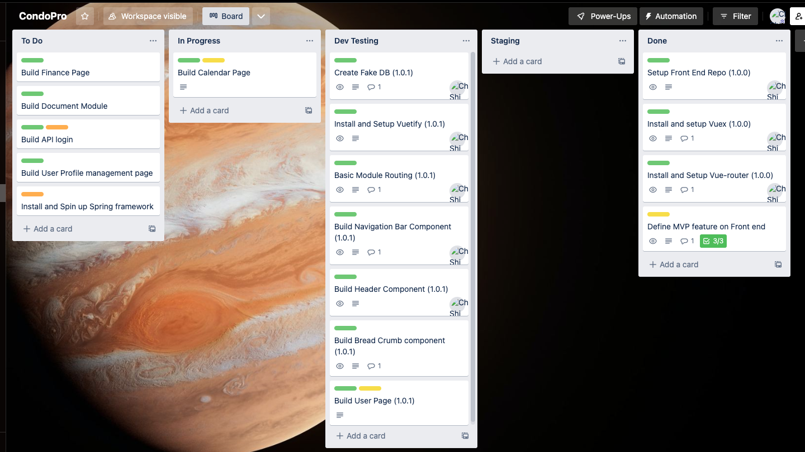
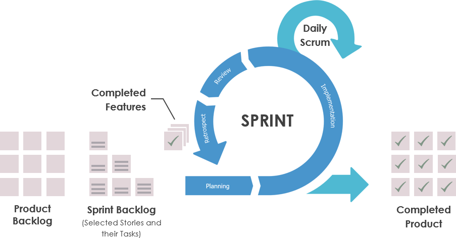

# Project Planning
- [x] What is a project
- [x] Popular Workflow
- [x] Managing and implementation of a project
- [x] Discussion

## What is a project
* A planned set of tasks with requirements and desired outcome
* Personal Project
* Group projects

## Managing Project

### Waterfall
* You quote and plan the project all at once
* Work on one piece at a time and launch project at-once
* Discovery - Design - Database - Back End - Front End - Testing - Launch
* Advantage: more "natural" to begin with. Low learning curve
* Disadvantage: roadblocks, less flexible to change, hard to split tasks

    

### Kanban
* A popular system to visiualize and implement Agile concept, usually in the form Kanban Board

    

### Scrum
* Teamwork framework for fast and flexible development
* Both Iterative and Incrementive
* Completed project is delivered throughoutly and iteratively based on **Sprint**
* Scrum Team:
    * Scrum Master
    * Dev Team (Developers, DevOps, QA)
    * Product Owner
* Pros
    * Flexibale, easy to catch bugs, unwanted direction
    * High quality of code base, more test
    * Fast iteration and evolution
* Cons?
    * Can be expensive due to scope expansion
    * Less predicitable

    

### Sprint
* A sprint is a short, time-boxed period when a scrum team works to complete a set amount of work
* Between one to four week, usually represent one iteration cycle
* How a sprint work?
    1. Sprint Planning - Determine workloads and task assignment from backlog
    2. Daily Scrum Meeting - Team Catch Up
    3. Implementation - Team works on the tasks
    4. Backlog Grooming - Re-arrange backlog
    5. Review &  Restrospective - Team Self reflection before a new sprint to look for improvement

    

### Project Planning - Initial Design / Brainstorming Phase
1. Define User Stories (Nouns => Tables)
2. Database Design
3. Routes (Backend Workflow)
4. Wireframing and Design (Front End user workflow)
5. Set Up project skeloton (Github, Install Framework, Setup DB)

**If using Scrum, you will do multiple mini-planning throughout the cycle**

### Discussion

##### Case Study 1
Your team decided to build online shopping application called **Lightshop**. You decided to build a prototype that contains ONLY the MVPs. Your team has list out the following features:
1. As a guest, I need to be able to register my account with Email password, or to use 3rd party signin with Google, Apple ID or Facebook account
2. As a user, I want to be able to search or filter products by category, name and price
3. As a user, I want to be able to add product to my cart and re-visit for check out in the future
4. As a user, I want to be able to check out my order with Credit Card, Interact, Gift card or Paypal
5. As a user, I want to download my invoice as a form of PDF.

Your team quotes 2 weeks of full time work on this feature assuming everything goes well. Your company want to see the project demo in 2 weeks. What would you recommend?

**Suggesstion**: 
- Every Story comes with risk and uncertainty. Do not rely on ideal situation. Add margin to your time estimate. 
- Consider adding additional time for uncertainty, your team will not meet the deadline. So think about revisit MVPs
- Some feature can be remove from MVP. (Login and Payment Options)

##### Case Study 2
Your team has deployed the first version of **Lightshop** to production. In the last Sprint, you have been working really hard and you feel that you took on more works that you can properly handled. You manage to get through it by cutting the time on code linting and testing. It turns out that your code work and not causing any issue. But you don't like the way you worked. What you can do?

**Suggesstion**:
- You can share your experiences in team's Retrospective meeting.
- Task assigment should follows team member's actual velocity, over committment is not encouraged
- You leverage the risk of reducing code quality and allow Product Owner to balance between speed and quality

##### Case Study 3
You are in the middle of the Sprint and developing a new iteration of **Ligthtshop**. You are working on a Customer Support Live Chat feature. Your product owner comes to you with two stories that he wants to fill in to the Sprint.
1. Some customers is complaining about the check out process. They are not be able to use the credit cards. 
2. We want to add a feature of saving credit card information to user's profile for fast check out.

How would you arrange these two requests?

**Suggesstion**:

Even though Scrum methodology is relative flexible, a Sprint should follow its plan unless there is a valid reason. Adding a new feature is consider enhancement, non-urgent. It can be planned into the future sprint. Having user not be able to check out is urgent bugfix and can be move into as high priority. However, your team should unload some of your existing tasks in order to free up your room.

##### Case Study 4
You are assigned to work on the Credit Card checkout bug with high priority. The task/story you've provided is as follows:
- Customers reported that when they try to checkout using credit card, the system says invalid card number even though they input the correct number. 
- AC: All customers, when input correct card number, should be able to checkout

You tested it on your local env and on staging env and everything looks fine. What you should do?

**Suggestion**:

Your are not be able to reproduce the problem, which indicated insufficient information on the story. Ask product owner or reporter to provide more information before you can move on. Set the status to "Block"
- When does it originally happens? (To trace to logs, commits)
- Is is system wide or any specific user. (Maybe an API is down, global bug? User data corruption)